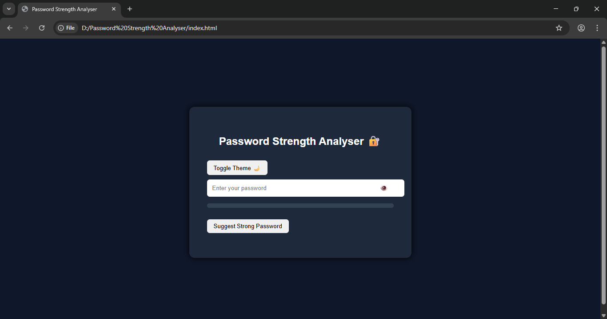
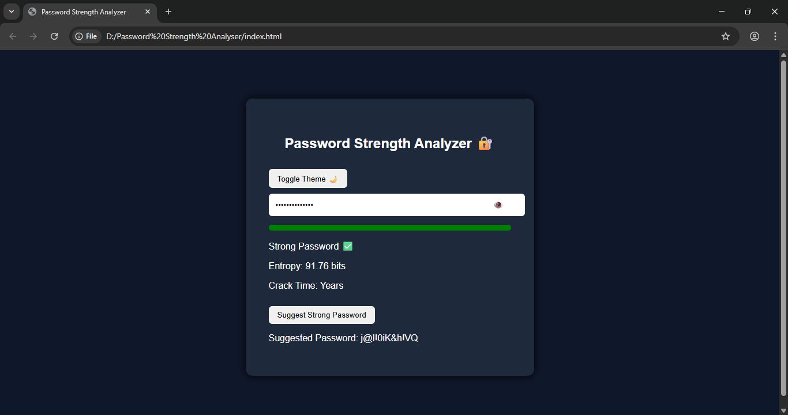
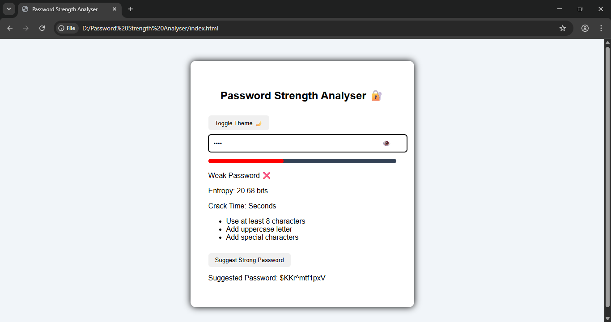

A simple cybersecurity-based web tool that analyses password strength and helps users create secure passwords.

# Password Strength Analyser

This project is a simple web application that checks the strength of a password entered by the user.

The system analyses the password based on different factors such as:
- Password length
- Uppercase letters
- Lowercase letters
- Numbers
- Special characters

These checks indicate whether the password is Weak, Medium, or Strong using a strength meter.

The project also calculates password entropy and estimates how long it would take to crack the password, indicating how secure it is.

# Features

- Real-time password strength detection
- Password entropy calculation
- Crack time estimation
- Password suggestions
- Strong password generator
- Dark / Light mode

# Technologies Used

- HTML
- CSS
- JavaScript

# How to Run

1. Download the project
2. Open **index.html** in your browser
3. Enter a password to check its strength

# Screenshots

## Password Strength Analyser

## Password Strength

## Toggle (Light) Mode

## Author
Samiksha Kadam
